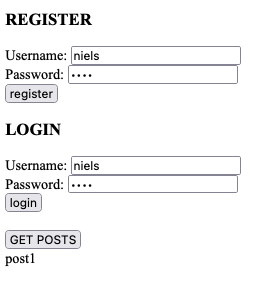

# Frontend Verbindung
  
Benutzt eure Lösung zu der letzten Aufgabe und baut ein Frontend für eure user Seite. Dabei brauchen wir folgende Features:
  

1. User Registrierung

- Im Frontend soll einfach ein Post Request mit Passwort und Username an das Backend gesendet werden.
- Das Backend speichert username und Passwort mithilfe von bcrypt in einem Array und schickt einen JWT Cookie zurück an den Client.

2. User Login

- Im Frontend soll wieder einfach nur ein Post Request mit Passwort und Username an das Backend gesendet werden. (Der Cookie wird automatisch mitgeliefert.)
- Im Backend wird das JWT Token aus dem Cookie gelesen, verifiziert und die Daten aus dem Cookie an die Login Middleware weitergeleitet.

3. Posts ansehen
- Falls der User eingeloggt ist, sollen hier alle Posts des dazugehörigen Usernamens angezeigt werden.

### Beispiel:

### Tips: 
Im public Ordner findet ihr zwei "starter"-Dateien, die euch helfen sollen, einen Einstieg zu finden. Wenn ihr sie verwenden wollt, dann solltet ihr sie natürlich umbennen :)

Einen Cookie könnt ihr aus dem Backend so senden:

    res.cookie("token", accessToken, { httpOnly:  true, sameSite:  "lax" }).send("cookie set");
Um das gesamte Frontend in einem `public`Ordner auszuliefern könnt ihr static middleware benutzen:

    app.use(express.static("./public"));

Falls ihr nicht mehr wisst wie man einen Post Request aus dem Frontend sendet:
https://stackoverflow.com/questions/29775797/fetch-post-json-data
